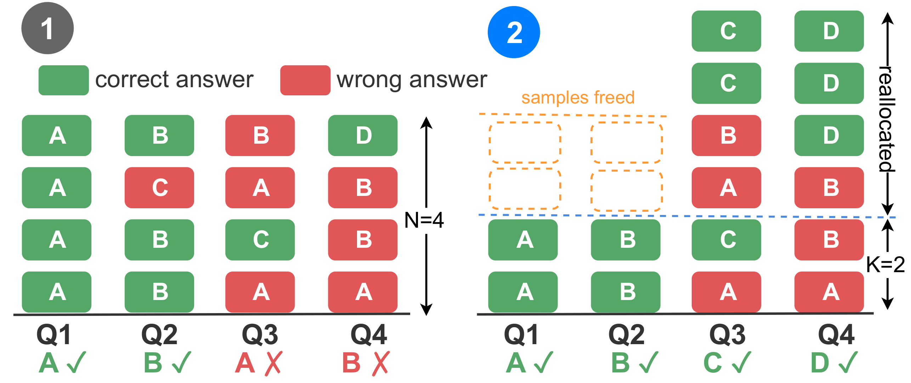

<div align="center">

  <h1><b> UAB: Uncertainty-Aware Budget Allocation </b></h1>
  <p><i>Spend test-time compute where it matters — adaptive sampling for LLM reasoning.</i></p>
</div>

<div align="center">

[](https://arxiv.org/pdf/2605.26849)
[](https://www.python.org/)
[](https://github.com/vllm-project/vllm)

</div>

<div align="center">

🚀 [**Getting Started**](#install) **|**
🔧 [**Usage**](#usage) **|**
🧪 [**Reproducing Results**](#reproduce) **|**
🎯 [**Benchmarks**](#bench) **|**
📂 [**Project Structure**](#structure)

</div>

**UAB** redistributes a *fixed* sampling budget across questions by difficulty. Uniform allocation oversamples easy questions that have already converged, and leaves hard ones with too few samples to reach the correct answer. UAB casts the allocation as a **concave integer program** solved in two phases:

- **Phase 1 — Probe.** `K=2` generations per question and use **vote entropy** of their extracted answers as the difficulty signal. These samples also count toward the final majority vote.
- **Phase 2 — Allocate.** A **marginal-greedy** algorithm distributes the remaining `(N-K)·M` budget, exactly maximizing a concave coverage surrogate. Questions that already agree have zero marginal gain, so their budget goes to the ones that disagreed.

No auxiliary model, no extra LLM call. The signal uses only the extracted answers.

<div align="center">

</div>

📜 **Paper:** [*Uncertainty-Aware Budget Allocation for Adaptive Test-Time Reasoning*](https://arxiv.org/pdf/2605.26849).

> If you find this repository helpful for your work, please consider citing as follows:
>
> ```LaTeX
> @article{nguyen2026uncertainty,
>    title={Uncertainty-Aware Budget Allocation for Adaptive Test-Time Reasoning},
>    author={Nguyen, Manh and Gupta, Sunil and Le, Hung},
>    journal={arXiv preprint arXiv:2605.26849},
>    year={2026}
> }
> ```
---

## <a name="install"></a> 🚀 Installation

#### ⏬ Environment Setup

```bash
git clone https://github.com/manhitv/UAB.git UAB
cd UAB

conda create -n uab python=3.11 -y
conda activate uab
pip install -r requirements.txt
```

---

## <a name="usage"></a> 🔧 Usage

**Run UAB on MATH-500 with a per-question budget of `N=4` (defaults: `K=2`, vote entropy, `tau=1`):**

```bash
python src/main.py --model qwen2.5-1.5b --data math500 --data_size 500 \
  --budget_mode uav_base --num_agents 4 --seed 42
```

**Run a baseline (uniform self-consistency) under the same budget:**

```bash
python src/main.py --model qwen2.5-1.5b --data math500 --data_size 500 \
  --budget_mode vote --num_agents 4 --seed 42
```

#### Key flags

| Flag | Description |
|------|-------------|
| `--budget_mode`  | `vote` (Uniform), `random`, `length`, `llm_judge`, `asc` (baselines) or `uav_base` (**UAB**) |
| `--num_agents N` | Per-question budget `N` (total responses per question) |
| `--asc_thresh`   | ASC stopping threshold (`--budget_mode asc`; `--num_agents` is its per-question cap) |
| `--data` / `--data_size` | Benchmark name and number of test questions |
| `--model`        | Model key (see [Benchmarks](#bench)) |
| `--seed`         | Random seed (paper averages over `42 44 46`) |

#### Ablation flags

Defaults reproduce the method as described above; these vary it.

| Flag | Description |
|--------|-------------|
| `--tau`              | Sharpness of `p = exp(-H/tau)` (default `1`) |
| `--phase1_samples K` | Phase-1 samples per question (default `2`) |
| `--uncertainty_mode` | `vote_entropy` (default) or a log-prob signal: `anll`, `nll`, `token_var`, `min_token_nll` |
| `--no_phase1_vote`   | Exclude Phase-1 samples from the final vote. Spends `N-K` samples per question rather than `N` |

#### ⚡ Quick validation

Run a short end-to-end check of the full pipeline:

```bash
bash scripts/validate.sh
```

#### 📒 Outputs

After each run:
- **Accuracy** is appended to `out/<dataset>_logs.tsv` (one row per run).
- **Full history** (responses, uncertainty, per-response token counts, wall-clock time, difficulty score) is serialized to `out/history/<experiment_name>.jsonl`.
- `--no_phase1_vote` ablation logs to `out/novote_logs.tsv`.
- `--debug` runs on a small slice and prefixes the filename with `DEBUG_`.

---

## <a name="reproduce"></a> 🧪 Experiment Sweeps

The `scripts/` directory bundles the sweeps that generate the runs, each a thin loop over `src/main.py`. All of them average over **seeds `42 44 46`**.

| Script | Sweep |
|--------|-------|
| `scripts/run_main_table.sh`  | 6 methods × 5 benchmarks × Qwen2.5-1.5B/7B, Llama3.2-3B, `N=4` |
| `scripts/run_bigmodels.sh`   | 6 methods × 5 benchmarks × GPT-OSS-20B, Gemma3-27B, `N=4` |
| `scripts/run_scaling.sh`     | Uniform / ASC / UAB over `N∈{4,8,12,16}` |
| `scripts/run_ablations.sh`   | `tau`, Phase-1 size `K`, difficulty signal, Phase-1 vote |
| `scripts/validate.sh`        | Quick end-to-end smoke test |

**ASC** has no budget parameter, so set `ASC_THRESH` (default `0.95`) per model and `N` to match its realized average budget to `N`, e.g. `ASC_THRESH=0.9 bash scripts/run_main_table.sh`. **PETS** (Liu et al., ICML 2026) use the authors' released code rather than reimplementing.

---

## <a name="bench"></a> 🎯 Benchmarks

#### ☝️ Tested Models

| Model key | Hugging Face / API |
|-----------|--------------------|
| `qwen2.5-1.5b`     | `Qwen/Qwen2.5-1.5B-Instruct` |
| `qwen2.5-7b`       | `Qwen/Qwen2.5-7B-Instruct`   |
| `llama3.2-3b`      | `meta-llama/Llama-3.2-3B-Instruct` |
| `gptoss`           | `openai/gpt-oss-20b`         |
| `gemma3-27b`       | `google/gemma-3-27b-it`      |

#### ✌️ Supported Benchmarks

| `--data` | `--data_size` | Task |
|----------|---------------|------|
| `math500`      | 500 | Competition math |
| `formal_logic` | 0 (full) | Deductive reasoning (MMLU Formal Logic) |
| `deepscaler`   | 300 | Competition math |
| `gsm8k`        | 300 | Grade-school math |
| `prog_expr`    | 100 | Graded Arithmetic (procedurally generated, 10 difficulty levels) |

Datasets are loaded automatically via `data/data_utils.py`. Graded Arithmetic is generated on the fly.

---

## <a name="structure"></a> 📂 Project Structure

```text
UAB/
├── scripts/           # Experiment sweeps over src/main.py
│   ├── common.sh
│   ├── validate.sh
│   ├── run_main_table.sh
│   ├── run_bigmodels.sh
│   ├── run_scaling.sh
│   └── run_ablations.sh
└── src/
    ├── main.py        # Single entry point: baselines, ASC, UAB
    ├── evaluator.py   # Answer parsing and metric evaluation
    ├── utils.py       # Marginal-greedy allocation and baseline allocators
    ├── model/         # vLLM backend and sampling configuration
    └── data/          # Benchmark dataset loaders
```

---

## Acknowledgements

* [vLLM](https://github.com/vllm-project/vllm) — fast batched inference

This project is released under the [MIT License](LICENSE).
